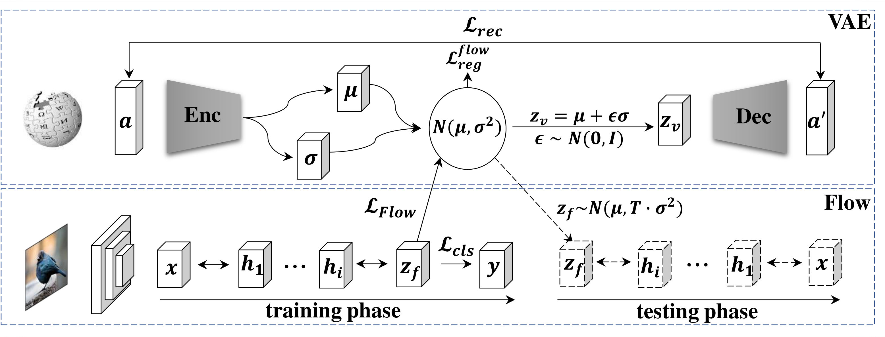

# VAE-cFlow-ZSL

Official Implementation for ["Generalized Zero-Shot Learning via VAE-Conditioned Generative Flow"](https://arxiv.org/abs/2009.00303)

## Overview


## Code Structure
```
├── README.md
├── train_vaepriorflow.py 
├── dataset_GBU.py        
├── classifier.py         
├── scripts/      
├── vaeflow/          
├── pics
├── data
│   ├── AWA1
│   ├── AWA2    
│   ├── CUB
│   └── SUN
```

## How to use

1. Download data from [Google Cloud](https://drive.google.com/file/d/1SVZ9F5Vl4txvCGrcz422jafe0jzGI83t/view?usp=sharing)
2. Set up conda environment

    ```
    conda create -n ZSL python=3.6
    conda install -c pytorch pytorch torchvision cudatoolkit=10.0
    ```
3. Train

    ```
    cd scripts/
    bash train_cub.sh
    ```

## Cite
If you use this code base in your work, please cite
```
@article{gu2020generalized,
  title={Generalized Zero-Shot Learning via VAE-Conditioned Generative Flow},
  author={Gu, Yu-Chao and Zhang, Le and Liu, Yun and Lu, Shao-Ping and Cheng, Ming-Ming},
  journal={arXiv preprint arXiv:2009.00303},
  year={2020}
}
```
